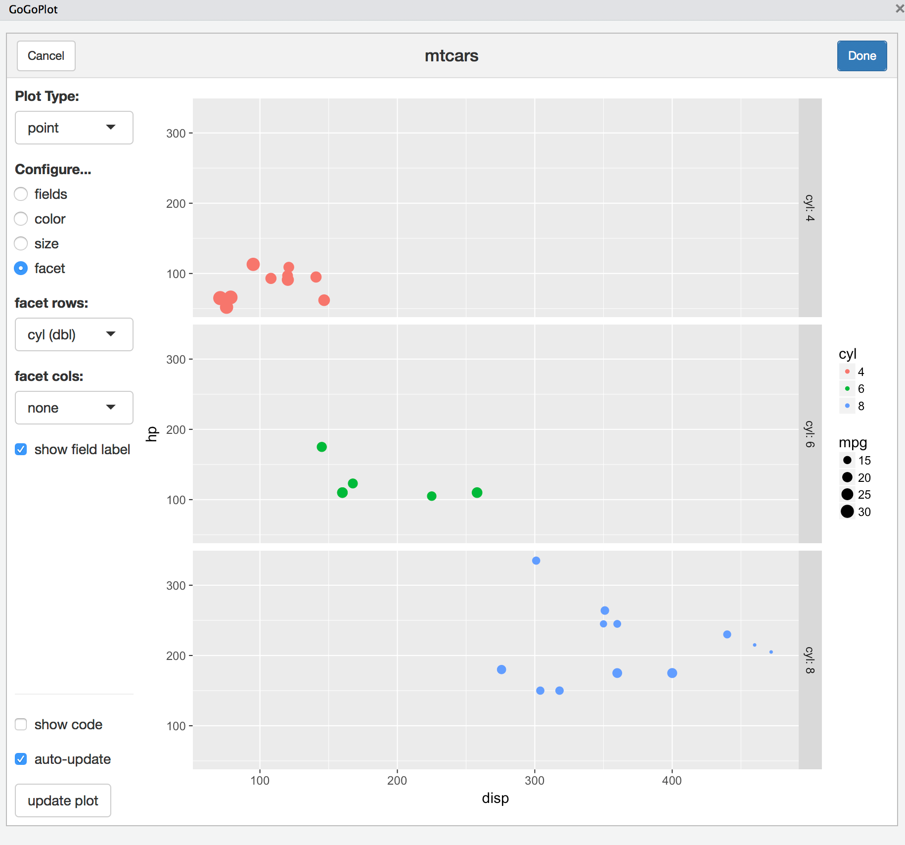

```{r, echo = FALSE}
knitr::opts_chunk$set(
  collapse = TRUE,
  comment = "#>",
  fig.path = "README-"
)
```

# gogoplot

`gogoplot` provides a simple GUI for building a [`ggplot`](http://ggplot2.tidyverse.org) data visualization (using a [`shiny` HTML gadget](https://shiny.rstudio.com/articles/gadgets.html)). A data viz GUI is not a new thing. But the feature that `gogoplot` strives to achieve is the ability to return *either* the final plot *or* the code used to make that plot. This makes `gogoplot` an educational tool and a way to make your visualizations reproducible. 

This package is a work in progress. I would love help improving it! Check out the "*Contribute*" section if you're interested.

## Install
`gogoplot` is only available on github. You can install it from here with the code below, using the `devtools` package.

```{r installation, eval = FALSE}
# install.packages("devtools")
devtools::install_github("wcmbishop/gogoplot")
```

## Example

The current version of `gogoplot` has just one function - `plot_gadget()`. When you pass in a data-frame, a gadget UI will appear (either in your RStudio Viewer pane or in a pop-up window). From there, you can get to plotting! At the end, return the plot you made or the code needed to make it yourself.

```{r example, echo=TRUE, eval=FALSE}
library(gogoplot)
plot_gadget(mtcars)
```


## Contribute
This is the very beginning of this package, and I would love help and feedback in developing it. The core concept is to provide simple GUIs for common R activities, which can then return the generated code as a result. As mentioned above, this seems useful both as a learning tool and a way to generate reproducible code. I'd ideally like to build these GoGo gadgets for some of the most valuable and frequently used [`tidyverse`](https://www.tidyverse.org) tools/workflows below. I'm starting with `ggplot2` because it's what got me into R. 

* plotting with [`ggplot2`](http://ggplot2.tidyverse.org)
* data manipulation with [`dplyr`](http://dplyr.tidyverse.org)
* data tidying with [`tidyr`](http://tidyr.tidyverse.org)

The core piece to making these gadgets robust and scalable is to implement the programmatic code generation well. Currently I am doing this in a terribly hacky way: I simply write the code twice. For example, when the user selects a column to use as a horizontal facet, I add a `facet_grid` geom layer to the plotting object and separately I add the same code as a string to a "code_vec" object. This method is prone to error and won't scale well. Ideally we'd have a robust way to add a plotting layer to both the plotting object AND the code vector in one call. Seems like a good use-case for some functional programming (and [quasiquotation](http://dplyr.tidyverse.org/articles/programming.html#quasiquotation)?).

If you would like to help on this core code/object accumulation method, please post a new github issue or send me a pull-request.
